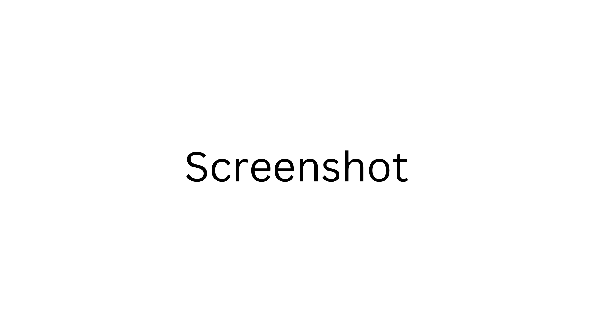

<div align="center">
  <h3 text-align="center">
    %TITLE%
  </h3>
  <p align="center">
    <a href="https://friedrith.github.io/react-composition">Demo</a> | 
    <a href="https://friedrith.github.io/react-composition/slides">Slides</a> | 
    <a href="https://thibault-friedrich.medium.com/keep-your-react-components-maintainable-with-solid-react-composition-codecraftsmanship-4-2969834e9ffa">Article</a>
  </p>

  
</div>

## Introduction (to remove when you use this template)

This is a template for a talk. It uses [slidev](https://sli.dev/).

> You can check [https://github.com/friedrith/react-composition](https://github.com/friedrith/react-composition) as an example.

Read the file [GETTING_STARTED.md](./GETTING_STARTED.md) to know how to use this template.

## Getting started

```bash
pnpm install
pnpm slides
# in another terminal
pnpm demo
```

## Versions

Several versions of this project are available:

- [Version 1](url of the talk)

## License

Distributed under the MIT License. See [LICENSE](./LICENSE) for more information.
